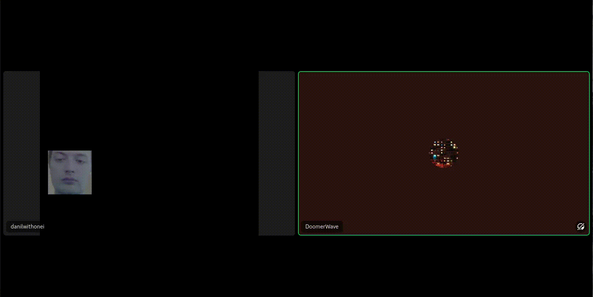

# super_deepfake

ultra mega deepfake(not) in real time, with virtual camera, for calls in Discord, Google Meet, Zoom, etc.

## Effects

|Deepfake | Pix |Rock |
|:---: |:---:| :---:|
|  |||
|**DVD** | **JESUS** |**ENOT** |
|  |||
|**DRAW** | **TEXT** |**GLITCH** |
|  |||

this is only part of the effects, the names will still change.

### install

```bash
sudo apt-get install -y libxcb-cursor-dev
pip install -r requirements.txt
```

### before run

if you have Linux then:

1. `sudo modprobe v4l2loopback`

if you have Windows then:

1. my condolences.
2. install `OBS`.

### Run

```bash
python main.py
```
